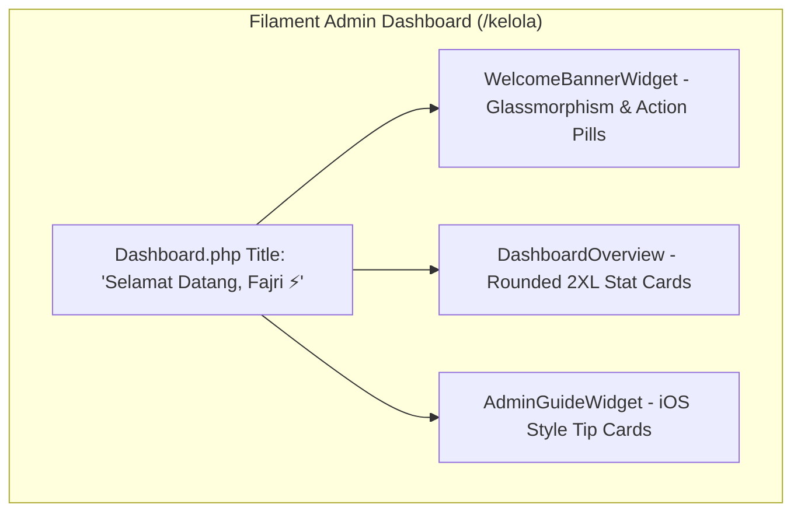

# Gen Z "Clean Studio Glass" Admin Dashboard Implementation Plan

> **For agentic workers:** REQUIRED SUB-SKILL: Use superpowers:subagent-driven-development to implement this plan task-by-task. Steps use checkbox (`- [ ]`) syntax for tracking.

**Goal:** Transform the Filament Admin Dashboard (`/kelola`) into a Gen Z "Clean Studio Glass" aesthetic with personalized greetings for Fajri, quick action pills, rounded-2xl glassmorphism stat cards, and iOS-style tip cards.

**Architecture:**
1. Update `app/Filament/Pages/Dashboard.php` title to `'Selamat Datang, Fajri ⚡'`.
2. Create `WelcomeBannerWidget` (`app/Filament/Widgets/WelcomeBannerWidget.php` and `resources/views/filament/widgets/welcome-banner.blade.php`).
3. Redesign `AdminGuideWidget` view (`resources/views/filament/widgets/admin-guide.blade.php`) into Apple-style Tip Grid Cards.
4. Enhance `DashboardOverview` widget styling and icons.

**Architecture Diagram:**



**Tech Stack:** Laravel 10, Filament PHP 3, Blade, Tailwind CSS.

## Global Constraints
- Target File 1: `app/Filament/Pages/Dashboard.php`
- Target File 2: `app/Filament/Widgets/WelcomeBannerWidget.php`
- Target File 3: `resources/views/filament/widgets/welcome-banner.blade.php`
- Target File 4: `app/Filament/Widgets/DashboardOverview.php`
- Target File 5: `resources/views/filament/widgets/admin-guide.blade.php`

---

### Task 1: Update Dashboard Page & Create Welcome Banner Widget

**Files:**
- Modify: `app/Filament/Pages/Dashboard.php`
- Create: `app/Filament/Widgets/WelcomeBannerWidget.php`
- Create: `resources/views/filament/widgets/welcome-banner.blade.php`

- [ ] **Step 1: Create `app/Filament/Widgets/WelcomeBannerWidget.php`**

```php
<?php

namespace App\Filament\Widgets;

use Filament\Widgets\Widget;

class WelcomeBannerWidget extends Widget
{
    protected static bool $isDiscovered = false;
    protected static string $view       = 'filament.widgets.welcome-banner';
    protected int | string | array $columnSpan = 'full';
    protected static ?int $sort         = -10;
}
```

- [ ] **Step 2: Create `resources/views/filament/widgets/welcome-banner.blade.php`**

```blade
<x-filament-widgets::widget>
    <div class="relative overflow-hidden rounded-2xl bg-gradient-to-r from-gray-900 via-gray-800 to-black p-6 sm:p-8 border border-amber-500/20 shadow-xl backdrop-blur-xl">
        <!-- Background Ambient Glow -->
        <div class="absolute -right-10 -top-10 h-40 w-40 rounded-full bg-amber-500/10 blur-3xl pointer-events-none"></div>
        <div class="absolute -left-10 -bottom-10 h-40 w-40 rounded-full bg-purple-500/10 blur-3xl pointer-events-none"></div>

        <div class="relative z-10 flex flex-col md:flex-row md:items-center justify-between gap-6">
            <div>
                <div class="inline-flex items-center gap-2 px-3 py-1 rounded-full bg-amber-500/10 border border-amber-500/30 text-amber-400 text-xs font-medium tracking-wide uppercase mb-3">
                    <span class="w-2 h-2 rounded-full bg-amber-400 animate-pulse"></span>
                    Fajri Studio Portal
                </div>
                <h1 class="text-2xl sm:text-3xl font-extrabold text-white tracking-tight">
                    Yo Fajri! 📸 Porto Kamu Siap Diperbarui.
                </h1>
                <p class="mt-2 text-sm text-gray-300 max-w-xl">
                    Kelola foto, atur kategori, dan ubah tampilan website kamu dengan mudah dari satu tempat.
                </p>
            </div>

            <!-- Quick Action Pills -->
            <div class="flex flex-wrap items-center gap-3">
                <a href="/kelola/photos/create" class="inline-flex items-center gap-2 px-4 py-2.5 rounded-xl bg-gradient-to-r from-amber-500 to-amber-600 hover:from-amber-400 hover:to-amber-500 text-gray-950 font-bold text-xs shadow-lg shadow-amber-500/20 transition-all transform hover:-translate-y-0.5 active:translate-y-0">
                    <svg class="w-4 h-4" fill="none" stroke="currentColor" viewBox="0 0 24 24"><path stroke-linecap="round" stroke-linejoin="round" stroke-width="2" d="M12 4v16m8-8H4"/></svg>
                    Upload Foto
                </a>
                <a href="/kelola/categories/create" class="inline-flex items-center gap-2 px-4 py-2.5 rounded-xl bg-gray-800/80 hover:bg-gray-700 text-gray-200 border border-gray-700 text-xs font-semibold transition-all transform hover:-translate-y-0.5 active:translate-y-0">
                    <svg class="w-4 h-4 text-amber-400" fill="none" stroke="currentColor" viewBox="0 0 24 24"><path stroke-linecap="round" stroke-linejoin="round" stroke-width="2" d="M9 13h6m-3-3v6m-9 1V7a2 2 0 012-2h6l2 2h6a2 2 0 012 2v8a2 2 0 01-2 2H5a2 2 0 01-2-2z"/></svg>
                    Tambah Kategori
                </a>
                <a href="/" target="_blank" class="inline-flex items-center gap-2 px-4 py-2.5 rounded-xl bg-gray-800/50 hover:bg-gray-700/80 text-gray-300 border border-gray-700/60 text-xs font-medium transition-all transform hover:-translate-y-0.5 active:translate-y-0">
                    <svg class="w-4 h-4 text-emerald-400" fill="none" stroke="currentColor" viewBox="0 0 24 24"><path stroke-linecap="round" stroke-linejoin="round" stroke-width="2" d="M10 6H6a2 2 0 00-2 2v10a2 2 0 002 2h10a2 2 0 002-2v-4M14 4h6m0 0v6m0-6L10 14"/></svg>
                    Lihat Web Live
                </a>
            </div>
        </div>
    </div>
</x-filament-widgets::widget>
```

- [ ] **Step 3: Update `app/Filament/Pages/Dashboard.php`**

```php
<?php

namespace App\Filament\Pages;

use App\Filament\Widgets\WelcomeBannerWidget;
use App\Filament\Widgets\DashboardOverview;
use App\Filament\Widgets\AdminGuideWidget;
use Filament\Pages\Dashboard as BaseDashboard;

class Dashboard extends BaseDashboard
{
    protected static ?string $navigationIcon  = 'heroicon-o-home';
    protected static ?string $navigationLabel = 'Beranda';

    public function getTitle(): string
    {
        return 'Selamat Datang, Fajri ⚡';
    }

    public function getWidgets(): array
    {
        return [
            WelcomeBannerWidget::class,
            DashboardOverview::class,
            AdminGuideWidget::class,
        ];
    }

    public function getColumns(): int | string | array
    {
        return 3;
    }
}
```

- [ ] **Step 4: Commit Task 1**

```bash
git add app/Filament/Pages/Dashboard.php app/Filament/Widgets/WelcomeBannerWidget.php resources/views/filament/widgets/welcome-banner.blade.php
git commit -m "feat(admin): add personalized welcome banner and update Dashboard title for Fajri"
```

---

### Task 2: Redesign Quick Guide Widget (`admin-guide.blade.php`)

**Files:**
- Modify: `resources/views/filament/widgets/admin-guide.blade.php`

- [ ] **Step 1: Replace `admin-guide.blade.php` content with iOS-style Clean Studio Tip Cards Grid**

```blade
<x-filament-widgets::widget>
    <div class="rounded-2xl bg-gray-900/90 border border-gray-800 p-6 shadow-xl backdrop-blur-xl">
        <div class="flex items-center justify-between mb-6">
            <div class="flex items-center gap-3">
                <div class="flex h-10 w-10 items-center justify-center rounded-xl bg-amber-500/10 text-amber-400 border border-amber-500/20 font-bold">
                    💡
                </div>
                <div>
                    <h3 class="text-base font-bold text-white tracking-wide">Panduan Cepat Studio</h3>
                    <p class="text-xs text-gray-400">Petunjuk praktis mengelola foto dan tampilan website Anda</p>
                </div>
            </div>
        </div>

        <div class="grid grid-cols-1 md:grid-cols-2 lg:grid-cols-4 gap-4">
            <!-- Card 1: Kategori -->
            <div class="p-4 rounded-xl bg-gray-800/60 border border-gray-700/50 hover:border-amber-500/40 transition-all duration-300 group">
                <div class="flex items-center gap-3 mb-2">
                    <span class="flex h-7 w-7 items-center justify-center rounded-lg bg-emerald-500/20 text-emerald-400 text-xs font-bold">1</span>
                    <h4 class="text-xs font-bold text-white uppercase tracking-wider group-hover:text-amber-400 transition-colors">Kategori Foto</h4>
                </div>
                <p class="text-xs text-gray-300 leading-relaxed">
                    Buat kategori lebih dulu di menu <strong>Kategori</strong> sebelum mengunggah foto portofolio.
                </p>
            </div>

            <!-- Card 2: Upload Foto -->
            <div class="p-4 rounded-xl bg-gray-800/60 border border-gray-700/50 hover:border-amber-500/40 transition-all duration-300 group">
                <div class="flex items-center gap-3 mb-2">
                    <span class="flex h-7 w-7 items-center justify-center rounded-lg bg-blue-500/20 text-blue-400 text-xs font-bold">2</span>
                    <h4 class="text-xs font-bold text-white uppercase tracking-wider group-hover:text-amber-400 transition-colors">Upload Karya</h4>
                </div>
                <p class="text-xs text-gray-300 leading-relaxed">
                    Dukung foto <strong>4:6 Portrait</strong> &amp; <strong>6:4 / 16:9 Landscape</strong> tanpa terpotong paksa.
                </p>
            </div>

            <!-- Card 3: Edit Website -->
            <div class="p-4 rounded-xl bg-gray-800/60 border border-gray-700/50 hover:border-amber-500/40 transition-all duration-300 group">
                <div class="flex items-center gap-3 mb-2">
                    <span class="flex h-7 w-7 items-center justify-center rounded-lg bg-purple-500/20 text-purple-400 text-xs font-bold">3</span>
                    <h4 class="text-xs font-bold text-white uppercase tracking-wider group-hover:text-amber-400 transition-colors">Teks &amp; Banner</h4>
                </div>
                <p class="text-xs text-gray-300 leading-relaxed">
                    Ubah teks About, Logo, dan foto Slide Hero di menu <strong>Teks &amp; Gambar Website</strong>.
                </p>
            </div>

            <!-- Card 4: Urutan -->
            <div class="p-4 rounded-xl bg-gray-800/60 border border-gray-700/50 hover:border-amber-500/40 transition-all duration-300 group">
                <div class="flex items-center gap-3 mb-2">
                    <span class="flex h-7 w-7 items-center justify-center rounded-lg bg-amber-500/20 text-amber-400 text-xs font-bold">4</span>
                    <h4 class="text-xs font-bold text-white uppercase tracking-wider group-hover:text-amber-400 transition-colors">Sistem Urutan</h4>
                </div>
                <p class="text-xs text-gray-300 leading-relaxed">
                    Angka <strong>kecil (1, 2, 3)</strong> akan tampil paling awal/atas di galeri website.
                </p>
            </div>
        </div>
    </div>
</x-filament-widgets::widget>
```

- [ ] **Step 2: Commit Task 2**

```bash
git add resources/views/filament/widgets/admin-guide.blade.php
git commit -m "feat(admin): redesign AdminGuideWidget into clean studio tip cards grid"
```

---

### Task 3: Verification & Deployment Check

- [ ] **Step 1: Check `git status` for clean state**
- [ ] **Step 2: Push changes to GitHub main branch to trigger Vercel deployment**

```bash
git add .
git commit -m "feat: Gen Z Clean Studio Glass Admin Dashboard redesign for Fajri"
git push origin main
```
