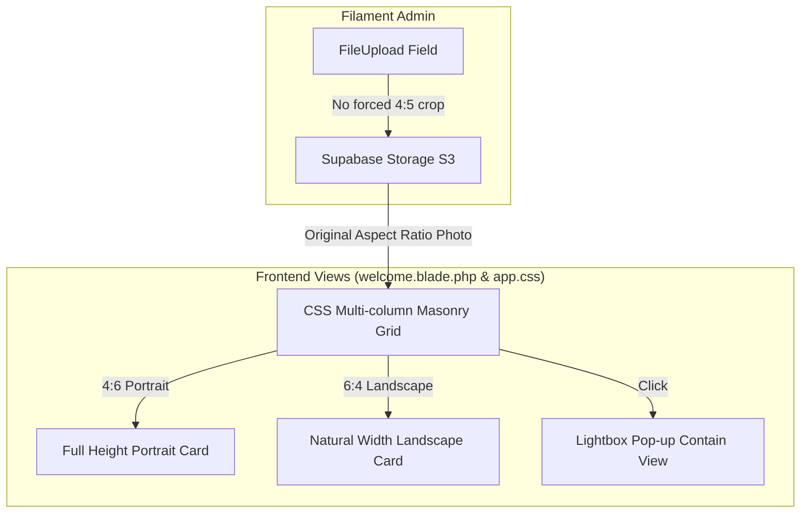

# Original Photo Aspect Ratio & Masonry Grid Layout Implementation Plan

> **For agentic workers:** REQUIRED SUB-SKILL: Use superpowers:subagent-driven-development to implement this plan task-by-task. Steps use checkbox (`- [ ]`) syntax for tracking.

**Goal:** Enable photographers to upload photos in their original aspect ratio (4:6 portrait, 6:4 / 16:9 landscape, etc.) via Filament Admin without forced cropping, and present all photos 100% complete in a responsive Masonry Grid layout on the website.

**Architecture:**
1. In `app/Filament/Resources/PhotoResource.php`, remove crop constraint (`4:5`) and fixed height target resize (`1500px`), keeping width optimization (`1200px`) and file size validation (4MB).
2. In `resources/css/app.css` and `resources/views/welcome.blade.php`, replace fixed 4:5 grid styling (`aspect-ratio: 4/5; object-fit: cover`) with CSS Multi-column Masonry (`columns: 3 320px; break-inside: avoid;`).

**Architecture Diagram:**



**Tech Stack:** Laravel 10, Filament PHP 3, Blade Templates, Vanilla CSS, Vite.

## Global Constraints
- Target File 1: `app/Filament/Resources/PhotoResource.php`
- Target File 2: `resources/css/app.css`
- Target File 3: `resources/views/welcome.blade.php`
- Compatibility: Existing uploaded photos in Supabase Storage remain untouched and non-broken.

---

### Task 1: Admin FileUpload Field Optimization (`PhotoResource.php`)

**Files:**
- Modify: `app/Filament/Resources/PhotoResource.php:40-54`

**Interfaces:**
- Consumes: Filament `Forms\Components\FileUpload`
- Produces: Original aspect ratio image stored on S3

- [ ] **Step 1: Update `PhotoResource.php` FileUpload configuration**

```diff
  Forms\Components\FileUpload::make('image_path')
      ->label('Upload Foto')
-     ->helperText('Upload foto dalam format JPG, PNG, atau WebP. Maksimal 4MB (otomatis dikompres ke 1200x1500 px agar loading website instan).')
+     ->helperText('Upload foto dalam format JPG, PNG, atau WebP. Maksimal 4MB (foto disimpan utuh sesuai rasio asli 4:6, 6:4, dll).')
      ->disk('s3')
      ->visibility('public')
      ->image()
      ->directory('photos')
-     ->imageResizeMode('cover')
-     ->imageCropAspectRatio('4:5')
-     ->imageResizeTargetWidth('1200')
-     ->imageResizeTargetHeight('1500')
+     ->imageResizeTargetWidth('1600')
      ->acceptedFileTypes(['image/jpeg', 'image/png', 'image/webp'])
      ->maxSize(4096) // 4MB limit to safely fit within Vercel's 4.5MB payload limit
      ->required(),
```

- [ ] **Step 2: Commit Task 1**

```bash
git add app/Filament/Resources/PhotoResource.php
git commit -m "feat(admin): allow original aspect ratio uploads in PhotoResource"
```

---

### Task 2: CSS Masonry Grid Implementation (`app.css`)

**Files:**
- Modify: `resources/css/app.css:373-448`

**Interfaces:**
- Consumes: `.gallery-grid`, `.gallery-item`, `.gallery-item img` classes in `resources/views/welcome.blade.php`
- Produces: Responsive Pinterest-style Masonry layout

- [ ] **Step 1: Update CSS rules for `.gallery-grid` and `.gallery-item` in `app.css`**

```diff
  .gallery-grid {
-     display: grid;
-     grid-template-columns: repeat(auto-fill, minmax(300px, 1fr));
-     gap: 1.5rem;
+     columns: 3 320px;
+     column-gap: 1.5rem;
  }

  .gallery-item {
      overflow: hidden;
      cursor: pointer;
      background-color: var(--bg-secondary);
-     aspect-ratio: 4/5;
+     aspect-ratio: auto;
+     height: auto;
+     break-inside: avoid;
+     margin-bottom: 1.5rem;
      opacity: 0; /* for staggered entrance */
      transform: translateY(20px);
      transition: opacity 0.6s ease-out, transform 0.6s ease-out;
      position: relative;
  }

  .gallery-item img {
      width: 100%;
-     height: 100%;
-     object-fit: cover;
+     height: auto;
+     display: block;
+     object-fit: contain;
      transition: transform 0.8s ease;
      position: relative;
      z-index: 1;
  }
```

- [ ] **Step 2: Run asset build to verify Vite compilation**

Run: `npm run build`

- [ ] **Step 3: Commit Task 2**

```bash
git add resources/css/app.css public/build/
git commit -m "feat(frontend): implement responsive CSS Masonry Grid layout"
```

---

### Task 3: Verification & Deployment Check

- [ ] **Step 1: Check `git status` for clean working tree**
- [ ] **Step 2: Verify asset build output**
- [ ] **Step 3: Push changes to GitHub main branch to trigger Vercel deployment**

```bash
git add .
git commit -m "feat: support original photo aspect ratio (4:6 & 6:4) with Masonry Grid"
git push origin main
```
