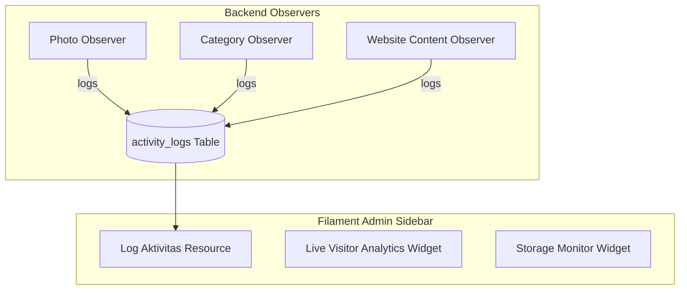

# Real-Time Suite & Sidebar Activity Log System Implementation Plan

> **For agentic workers:** REQUIRED SUB-SKILL: Use superpowers:subagent-driven-development to implement this plan task-by-task. Steps use checkbox (`- [ ]`) syntax for tracking.

**Goal:** Implement the Sidebar Activity Log System (`Log Aktivitas`) with WIB timestamping alongside 4 Real-Time Analytics and Operations Widgets for FAJRI Photography Studio Admin.

**Architecture:**
A database-backed activity logger listens to model events (`Photo`, `Category`, `WebsiteContent`) and records entries in `activity_logs`. A dedicated Filament Resource (`ActivityLogResource`) presents these logs in the Admin Sidebar. Real-time widgets monitor visitor analytics, storage, and private gallery toggles with Alpine.js & Livewire polling.



**Tech Stack:** Laravel 10, Filament PHP 3, Livewire 3, PostgreSQL (Supabase), Tailwind CSS, Alpine.js.

## Global Constraints
- Target File 1: `database/migrations/2026_07_26_000001_create_activity_logs_table.php`
- Target File 2: `app/Models/ActivityLog.php`
- Target File 3: `app/Filament/Resources/ActivityLogResource.php`
- Target File 4: `app/Observers/PhotoObserver.php`
- Target File 5: `app/Observers/CategoryObserver.php`
- Target File 6: `app/Observers/WebsiteContentObserver.php`
- Target File 7: `app/Filament/Widgets/LiveVisitorAnalyticsWidget.php`
- Target File 8: `app/Filament/Widgets/StorageMonitorWidget.php`

---

### Task 1: Activity Log Migration, Model & Filament Resource

- [ ] **Step 1: Create `database/migrations/2026_07_26_000001_create_activity_logs_table.php`**

```php
<?php

use Illuminate\Database\Migrations\Migration;
use Illuminate\Database\Schema\Blueprint;
use Illuminate\Support\Facades\Schema;

return new class extends Migration
{
    public function up(): void
    {
        Schema::create('activity_logs', function (Blueprint $table) {
            $table->id();
            $table->string('admin_name')->default('Fajri');
            $table->string('action_type');
            $table->string('module');
            $table->text('description');
            $table->string('ip_address')->nullable();
            $table->timestamps();
        });
    }

    public function down(): void
    {
        Schema::dropIfExists('activity_logs');
    }
};
```

- [ ] **Step 2: Create `app/Models/ActivityLog.php`**

```php
<?php

namespace App\Models;

use Illuminate\Database\Eloquent\Model;

class ActivityLog extends Model
{
    protected $fillable = [
        'admin_name',
        'action_type',
        'module',
        'description',
        'ip_address',
    ];
}
```

- [ ] **Step 3: Create Model Observers `PhotoObserver`, `CategoryObserver`, `WebsiteContentObserver`**

- [ ] **Step 4: Create `app/Filament/Resources/ActivityLogResource.php` with Table Columns and Sidebar Badge**

```php
<?php

namespace App\Filament\Resources;

use App\Filament\Resources\ActivityLogResource\Pages;
use App\Models\ActivityLog;
use Filament\Resources\Resource;
use Filament\Tables;
use Filament\Tables\Table;

class ActivityLogResource extends Resource
{
    protected static ?string $model = ActivityLog::class;
    protected static ?string $navigationIcon = 'heroicon-o-clock';
    protected static ?string $navigationLabel = 'Log Aktivitas';
    protected static ?string $navigationGroup = 'Sistem Studio';
    protected static ?int $navigationSort = 99;

    public static function table(Table $table): Table
    {
        return $table
            ->columns([
                Tables\Columns\TextColumn::make('created_at')
                    ->label('Tanggal & Waktu (WIB)')
                    ->dateTime('d M Y, H:i:s')
                    ->suffix(' WIB')
                    ->sortable(),
                Tables\Columns\BadgeColumn::make('action_type')
                    ->label('Aksi')
                    ->colors([
                        'success' => 'CREATE',
                        'info' => 'UPDATE',
                        'danger' => 'DELETE',
                        'warning' => 'SETTING',
                    ]),
                Tables\Columns\TextColumn::make('module')
                    ->label('Modul')
                    ->badge(),
                Tables\Columns\TextColumn::make('description')
                    ->label('Deskripsi Aktivitas')
                    ->searchable()
                    ->wrap(),
                Tables\Columns\TextColumn::make('admin_name')
                    ->label('Admin')
                    ->badge(),
            ])
            ->defaultSort('created_at', 'desc');
    }

    public static function getPages(): array
    {
        return [
            'index' => Pages\ListActivityLogs::route('/'),
        ];
    }
}
```

- [ ] **Step 5: Run `php artisan migrate`**

---

### Task 2: Real-Time Analytics & Storage Widgets

- [ ] **Step 1: Create `app/Filament/Widgets/LiveVisitorAnalyticsWidget.php` & Blade View**
- [ ] **Step 2: Create `app/Filament/Widgets/StorageMonitorWidget.php` & Blade View**
- [ ] **Step 3: Register Widgets in `Dashboard.php` & `AdminPanelProvider.php`**
- [ ] **Step 4: Run `npm run build` & verify build**
- [ ] **Step 5: Push commits to GitHub `main` for Vercel deployment**
